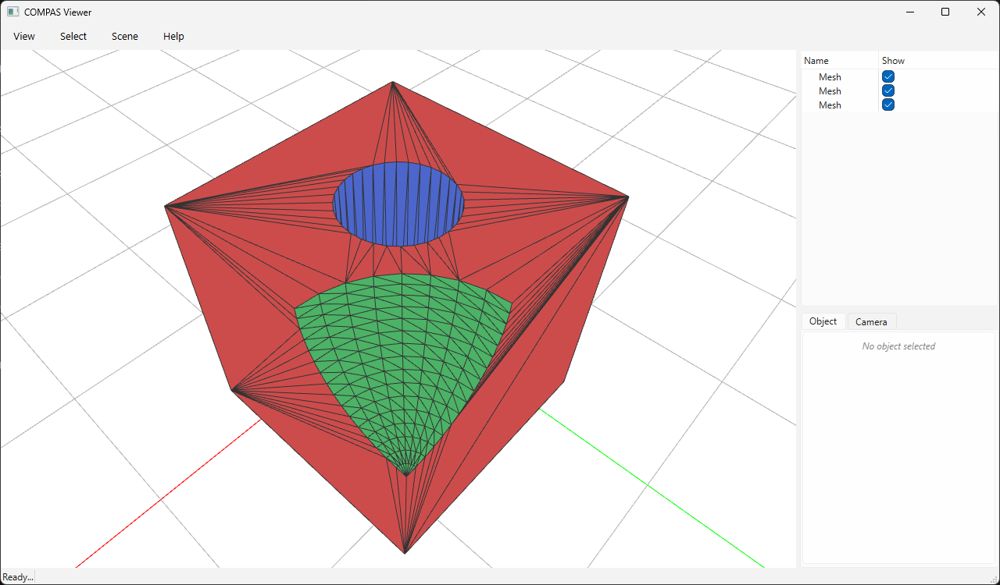

# Face Source Tracking



`boolean_chain_with_face_source` runs a boolean chain and additionally reports,
for every output triangle, **which input mesh and which original face it came
from**. The result is `(V, F, S)` where `S[i] = [mesh_id, face_id]`:

* `mesh_id` — the position of the source mesh in the input list.
* `face_id` — the row index of the original face in that mesh.

Tracking uses Manifold's native mesh-relation machinery (`OriginalID` and the
output run / face IDs).

`split_by_source` turns the tags into one submesh per input, perfect for
colouring each contribution differently.

Run it (requires `compas_viewer`):

```bash
python docs/examples/example_boolean_face_source.py
```

```python
--8<-- "docs/examples/example_boolean_face_source.py"
```
