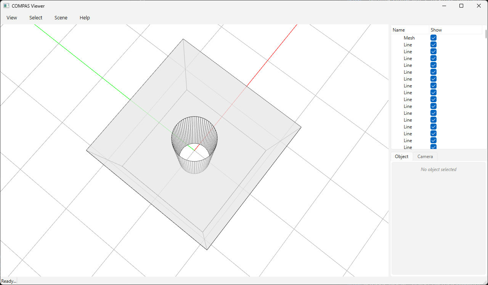

# Polygonal Faces & Clean Outlines



Manifold returns a triangle mesh, but it tags every output triangle with a
**coplanar-face id**: triangles that are coplanar and belong to the same planar
face share one id. The `*_with_polygons` functions return that id as a third
array `P`, so you can merge the triangle soup back into polygonal (n-gon) faces
and extract clean outlines. Faces that a solid passed through (here a drilled
cylinder) come back as a polygon **with a hole**.

```python
from compas_manifold.booleans import (
    boolean_difference_mesh_mesh_with_polygons,
    coplanar_outline_edges,
    coplanar_polygons,
)

V, F, P = boolean_difference_mesh_mesh_with_polygons(box, cylinder)

# Clean outline edges (feature edges between faces + hole rims):
E = coplanar_outline_edges(V, F, P)

# Polygonal faces, with holes nested under each outer loop:
faces = coplanar_polygons(V, F, P)
```

## Dealing with holes

A face that another solid passed through is **not** a simple polygon. Drill a
cylinder through a box and the entry/exit faces become **annuli**: one outer
square loop plus an inner circular hole loop — both sharing the same coplanar
id.

`merge_coplanar_faces(V, F, P)` returns *all* boundary loops of each coplanar
group. A face with holes yields more than one loop, and they are distinguished
by **orientation**: a loop wound consistently with the face normal (positive
signed area) is the outer boundary; a reversed loop (negative signed area) is a
hole.

`coplanar_polygons(V, F, P)` does this classification for you and nests each
hole under the outer loop that contains it (via a point-in-polygon test on the
face plane), returning a list of:

```python
{"normal": (nx, ny, nz), "outer": [i0, i1, ...], "holes": [[...], ...]}
```

A plain triangle/polygon mesh cannot store a face with a hole, so this
"outer + holes" form is the correct representation. From here you can:

* **draw clean outlines** directly — `coplanar_outline_edges` already includes
  the hole rims, since a hole boundary separates two different coplanar ids;
* **re-tessellate** the face by feeding `outer` + `holes` to a constrained
  Delaunay triangulator if you need a watertight planar mesh of the n-gon;
* **export** the loops as a polygon-with-holes (e.g. a Brep face or a COMPAS
  `Polygon` with holes).

Run it (requires `compas_viewer`):

```bash
python docs/examples/example_boolean_polygons.py
```

```python
--8<-- "docs/examples/example_boolean_polygons.py"
```
