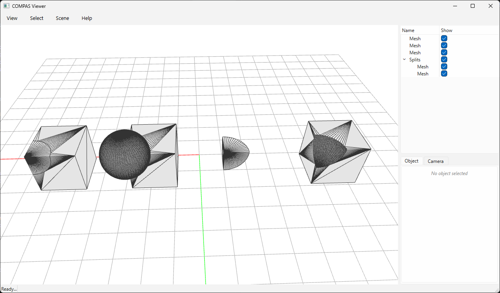

# Boolean Operations



The four core pairwise boolean operations on two triangle meshes (a box and an
offset sphere): **difference**, **intersection**, **union**, and **mesh
splitting**. Every result is a valid, watertight, oriented 2-manifold — Manifold
guarantees this for all operations.

Run it (requires `compas_viewer`):

```bash
python docs/examples/example_booleans.py
```

```python
--8<-- "docs/examples/example_booleans.py"
```
