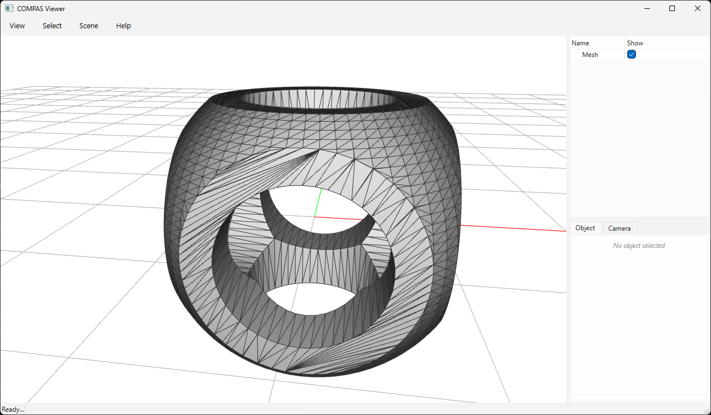

# compas_manifold



Robust, guaranteed-manifold mesh booleans for [COMPAS](https://compas.dev), powered by [Manifold](https://github.com/elalish/manifold). Every operation returns a valid, watertight 2-manifold — no precision tuning, no degenerate-input crashes.

_By [Petras Vestartas](https://github.com/petrasvestartas), Block Research Group, ETH Zürich. Built on [Manifold](https://github.com/elalish/manifold) (Emmett Lalish) and [nanobind](https://github.com/wjakob/nanobind) (Wenzel Jakob)._

## Features

| Function | Description |
| --- | --- |
| `boolean_union_mesh_mesh(A, B)` | Union of two meshes |
| `boolean_difference_mesh_mesh(A, B)` | Difference `A - B` |
| `boolean_intersection_mesh_mesh(A, B)` | Intersection of two meshes |
| `split_mesh_mesh(A, B)` | Split `A` with `B` |
| `boolean_chain(meshes, operations)` | Left-folded chain of ops, evaluated in C++ |
| `boolean_batch(meshes, operation)` | Single op across many meshes via `BatchBoolean` |
| `boolean_chain_with_face_source(meshes, operations)` | Chain + per-face source tracking |
| `boolean_difference_mesh_meshes(A, Bs)` | Subtract many cutters from `A` in one batch |

## Quick start

```python
from compas.geometry import Box, Sphere, Polyhedron
from compas_manifold.booleans import boolean_difference_mesh_mesh

A = Box(2).to_vertices_and_faces(triangulated=True)
B = Sphere(1.0, point=[1, 1, 1]).to_vertices_and_faces(u=32, v=32, triangulated=True)

V, F = boolean_difference_mesh_mesh(A, B)
shape = Polyhedron(V.tolist(), F.tolist())
```

See [Installation](installation.md) and the [Examples](examples/example_booleans.md).
